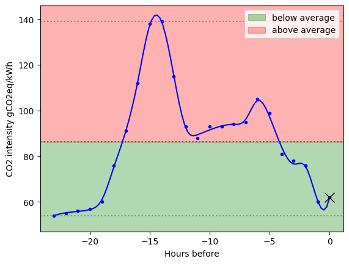
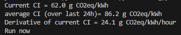

# CO2 compute decider 
## _Get real-time CO2 emission in your zone and decide if it is the right time to run a large computation considereing the average co2/kwh_ 

---
- Get the CO2 emission of the latests 24h from api.electricitymaps.com
- Check if the current CO2 emission is below the average of the last 24h
  - also check if the co2 emission derivative goes down or up
- If so, start computing. If not, wait till the co2 emission drops
---

## Example output: 
 
---

## TODO: 
- Implement this in a scheduler
- Example usage
- Add details on how to get api keys
- Documentation
  
